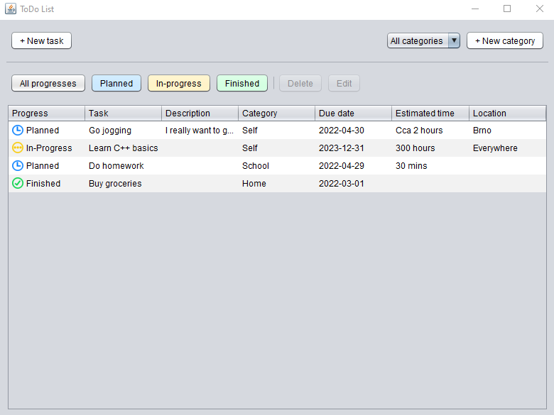
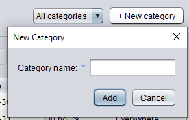
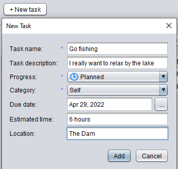
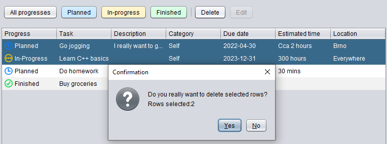
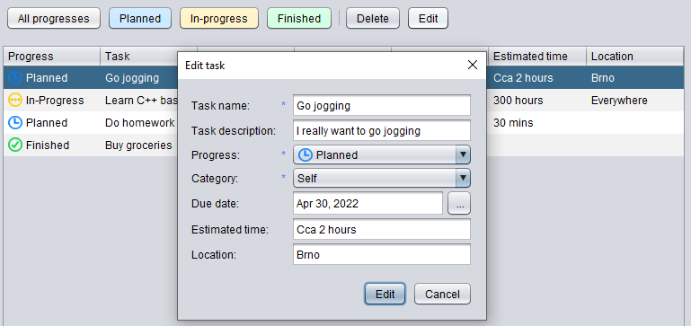
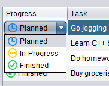
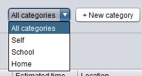
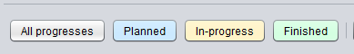
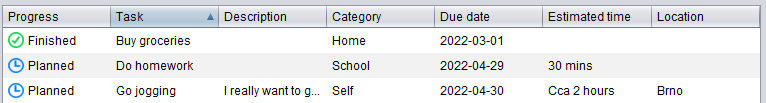

## ToDo List ##
This application can be used as a simple todo list:

### Task creation ###
User can categorize tasks to individual categories. Each task has one of three states: `Planned, In-Progress, Finished`.
The categories can be created by clicking on button `New category`. 
Tasks can be created by clicking on button `New task`.

 

Both of these forms hve a simple validation implemented - after clicking on Add, system checks, if all mandatory attributes (those marked with blue star) are filled. 

User may even delete or edit existing task. These actions are available after clicking on `Delete` or `Edit` button.

 

Progress can also be changed right from the table by clicking on Progress column.

### Sorting and filtering ###

There are even a few options, how to filter or sort tasks. 
Tasks with given category can be filtered by selecting category from top right corner.

Tasks progress can be filtered by clicking on progress buttons.

Sorting can be done by clicking on column headers.

### Technical info ###
App is based on Java Swing framework. To save data, app uses apache derby. 
App is localized to english and czech language.